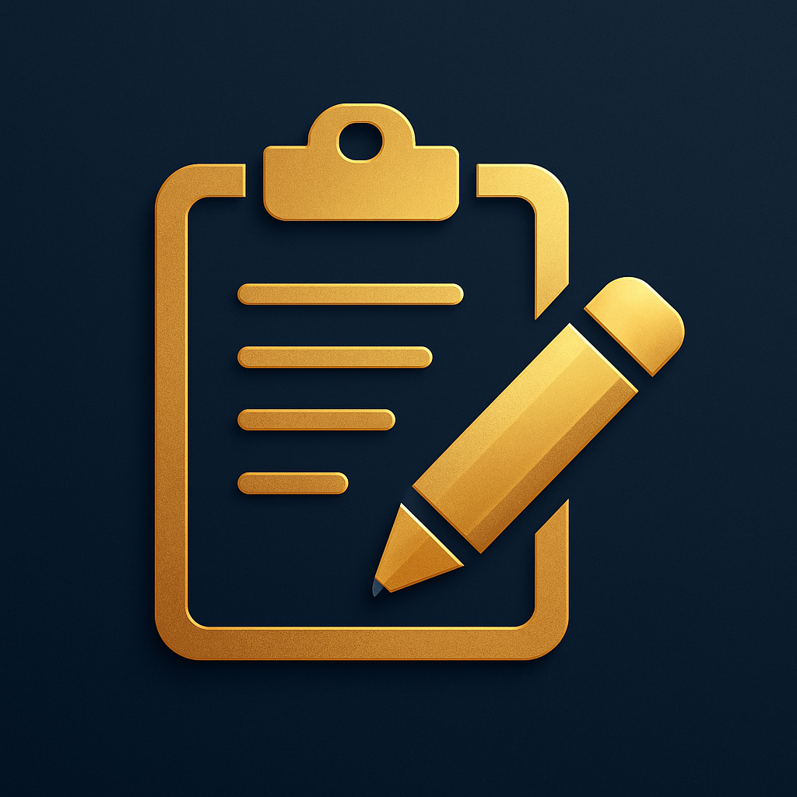

<div align="center">

# ClipSync



**Share your clipboard instantly across Android and Windows devices via Bluetooth**

[](https://android.com)
[](LICENSE)
</div>

---

## 🚀 What is ClipSync?

ClipSync is an Android application that enables seamless clipboard sharing between your
Android and Windows devices using Bluetooth technology. Copy text on one device and instantly access it on
another - no internet connection required!

### ✨ Key Features

- **🔗 Instant Clipboard Sharing**: Copy text on one device, access it immediately on paired devices
- **📱 Background Operation**: Works silently in the background - no need to keep the app open
- **🔵 Bluetooth-Based**: Uses secure Bluetooth RFCOMM protocol - no internet required
- **⚡ Auto-Copy**: Automatically copies received text to your clipboard - can be turned off
- **🔔 Smart Notifications**: Get notified when new clipboard content arrives - when auto-copy is off
- **🌙 Dark Mode Support**: Beautiful interface that adapts to your system theme
- **🔒 Privacy-First**: All data stays between your devices - no cloud storage

---

## 📱 How It Works

1. **Pair Your Devices**: Connect your Android devices via Bluetooth
2. **Select Devices**: Choose which paired devices to share clipboard with
3. **Start Sharing**: Enable the ClipSync service with one tap
4. **Copy & Share**: Copy text on any device and press share from the notification action button
5. **Background**: ClipSync works in the background, even when the app is closed

---

## 🛠️ Installation

### Download Options

#### Option 1: GitHub Releases (Recommended)

1. Go to [Releases](../../releases)
2. Download the latest `ClipSync-v1.0.0.apk` file
3. Enable "Install from Unknown Sources" in your Android settings
4. Install the APK file

#### Option 2: Build from Source

```bash
git clone https://github.com/aubynsamuel/clipSync-android.git
cd clipSync-android
./gradlew assembleRelease
```

---

## 🖥️ Windows Companion App

To sync your clipboard between Android and Windows, you need the ClipSync Windows Companion App:

➡️ [**Download or build it from here**](https://github.com/aubynsamuel/clipsync-windows.git)

Follow the instructions in the Windows app README to set up and pair with your Android device.

---

## 🎯 Quick Start Guide

### First Time Setup

1. **Install ClipSync** on all devices you want to share text with
2. **Enable Bluetooth** on all devices
3. **Pair your devices** through Android Bluetooth settings
4. **Open ClipSync** and grant necessary permissions

### Using ClipSync

#### Starting Clipboard Sharing

1. Open ClipSync
2. Select the devices you want to share with
3. Tap "Start Sharing"
4. The service will run in the background

#### Sharing Clipboard Content

1. Copy any text on your device (long press → Copy)
2. The text automatically appears on your paired devices
3. If Auto-Copy is enabled, it's instantly available in the clipboard
4. If Auto-Copy is disabled, you'll get a notification to manually copy

#### Managing the Service

- **View Status**: Check the persistent notification
- **Stop Service**: Tap "Dismiss" in the notification or use the stop button in the app
- **Update Settings**: Change Auto-Copy mode or selected devices anytime

---

## ⚙️ Settings & Configuration

### Auto-Copy Mode

- **Enabled**: Received text is automatically copied to your clipboard
- **Disabled**: You'll receive a notification to manually copy the text

### Device Selection

- Choose which paired Bluetooth devices to share clipboard with
- You can update your selection anytime without restarting the service

### Theme Options

- **Light Mode**: Clean, bright interface
- **Dark Mode**: Easy on the eyes, battery-friendly

---

## 🔒 Privacy & Security

ClipSync is designed with privacy in mind:

- **Local Communication**: All data transfers happen directly between your devices via Bluetooth
- **No Cloud Storage**: Your clipboard content never leaves your devices
- **No Internet Required**: Works completely offline
- **Temporary Storage**: Clipboard content is not permanently stored
- **Secure Protocol**: Uses Bluetooth RFCOMM with built-in security features

### Security Best Practices

- Only pair with devices you trust
- Be mindful when sharing sensitive information

---

## 🔧 Troubleshooting

### Common Issues

#### Devices Not Connecting

- Ensure both devices have Bluetooth enabled
- Check that devices are properly paired in Android Bluetooth settings
- Try unpairing and re-pairing the devices
- Restart the ClipSync service

#### Clipboard Not Syncing

- Verify the ClipSync service is running (check notification)
- Ensure both devices have ClipSync installed and running
- Check that the target device is selected in your device list
- Try copying different text content

#### App Permissions

- Grant all requested permissions during setup
- Check Android Settings → Apps → ClipSync → Permissions
- Ensure Bluetooth and Notification permissions are enabled

### Still Having Issues?

- Check our [Issues](../../issues) page for known problems
- Create a new issue with detailed information about your problem
- Include your Android version and device model

---

## 🤝 Contributing

We welcome contributions! Whether it's bug reports, feature requests, or code contributions, every bit helps make ClipSync better.

### How to Contribute

1. Fork the repository
2. Create a feature branch
3. Make your changes
4. Submit a pull request

### Development Setup

```bash
git clone https://github.com/aubynsamuel/clipsync-android.git
cd ClipSync-android
./gradlew build
```

---

## 📄 License

This project is licensed under the MIT License - see the [LICENSE](LICENSE) file for details.

---

## 🙏 Acknowledgments

- Built with modern Android development practices
- Uses Jetpack Compose for beautiful UI
- Implements Material Design 3 guidelines
- Special thanks to the Android development community

---

<div align="center">
  Made with ❤️ for seamless device connectivity

  ⭐ Star this repo if ClipSync helps you!
</div>
